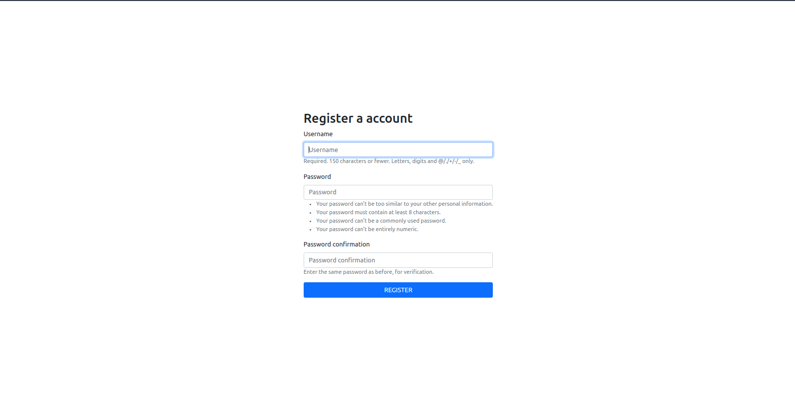

# Learning Logs - Personal Blog

First Project using Django, the application is a private Personal Blog.

## Contents
- [Screenshots](#screenshots)
- [Built with](#built-with)
- [What I Learned](#what-i-learned)
- [How do clone repository](#how-do-clone-repository)
___
### Screenshots





### Built with
- DJANGO
- BOOTSTRAP5
- HTML5/CSS/JS

### What I learned
 - Models
 - URLs (make paths)
 - Requisition process
 - Views/GenericViews
 - QuerySet API Django
 - Forms
 - Django Admin Interface
 - Database manipulation
 - Basic concepts of Authentication
 - Pagination and Filters

```python
class Topic(models.Model):
    """Um assunto sobre o qual o usuário está aprendendo."""
    title = models.CharField(max_length=200)
    date_added = models.DateTimeField(auto_now_add=True)
    owner = models.ForeignKey(User, on_delete=models.CASCADE)
    description = models.TextField(max_length=200)
    thumbnail = models.ImageField(upload_to='thumbnails/', null=True, blank=True)
    def __str__(self):
        return self.title
```

### How do clone repository
```
git clone https://github.com/Jackson-Vieira/LearningLog
cd LearningLog
pip install requirements.txt
python3 manage.py migrate
# python3 manage.py createsuperuser
python3 manage.py runserver
```
